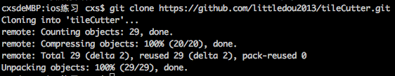
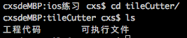
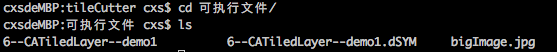
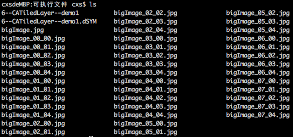

# tileCutter
MacOS命令行程序：剪裁图片到不同的文件中

该仓库包含三个目录：1）项目工程目录；2）包含可执行文件和样例图片的目录 3）文档需要的图片目录

## CATiledLayer

有些时候你可能需要绘制一个很大的图片，常见的例子就是一个高像素的照片或者是地球表面的详细地图。iOS应用通畅运行在内存受限的设备上，所以读取整个图片到内存中是不明智的。载入大图可能会相当地慢，那些对你看上去比较方便的做法（在主线程调用`UIImage`的`-imageNamed:`方法或者`-imageWithContentsOfFile:`方法）将会阻塞你的用户界面，至少会引起动画卡顿现象。

能高效绘制在iOS上的图片也有一个大小限制。所有显示在屏幕上的图片最终都会被转化为OpenGL纹理，同时OpenGL有一个最大的纹理尺寸（通常是2048\*2048，或4096\*4096，这个取决于设备型号）。如果你想在单个纹理中显示一个比这大的图，即便图片已经存在于内存中了，你仍然会遇到很大的性能问题，因为Core Animation强制用CPU处理图片而不是更快的GPU.

`CATiledLayer`为载入大图造成的性能问题提供了一个解决方案：将大图分解成小片然后将他们单独按需载入。让我们用实验来证明一下。

### 小片裁剪

这个示例中，我们将会从一个高分辨率（该仓库中提供的样例图片尺寸为：1920 × 1200）的图片入手。为了能够从`CATiledLayer`中获益，我们需要把这个图片裁切成许多小一些的图片。你可以通过代码来完成这件事情，但是如果你在运行时读入整个图片并裁切，那`CATiledLayer`这些所有的性能优点就损失殆尽了。理想情况下来说，最好能够逐个步骤来实现。

该仓库包含的项目工程目录是一个简单的Mac OS命令行程序，它将一个图片裁剪成小图并存储到不同的文件中。

## 如何使用该仓库

克隆仓库

`$git clone https://github.com/littledou2013/tileCutter.git`

进入可执行文件目录

`$cd titleCutter/`

`$cd 可执行文件/`

执行可执行文件

`$./6--CATiledLayer--demo1 bigImage.jpg`

最后会在可执行文件目录下生成小图片

